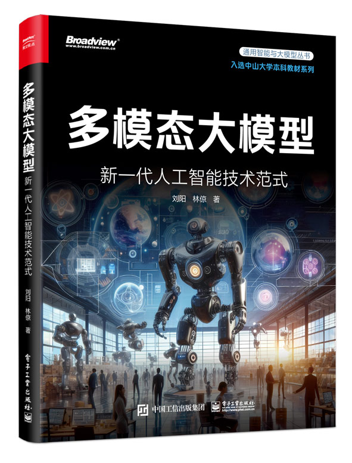
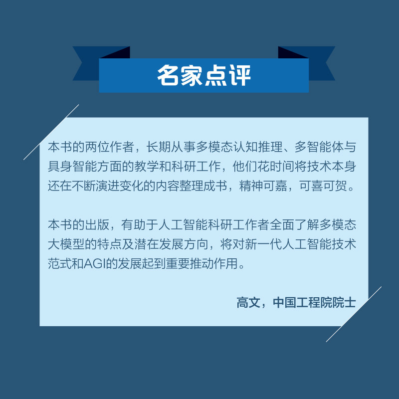
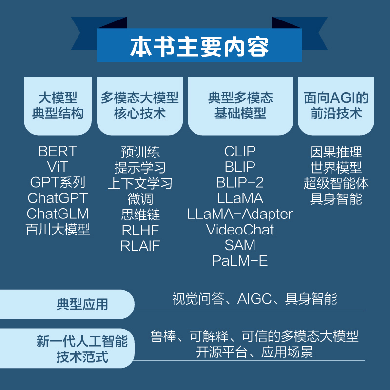

<div align=center>

</div>

## 本书介绍

本书系统地介绍了多模态大模型的关键技术、基础模型和典型应用。为了能够让低年级本科生和刚进入人工智能领域的从业者更容易理解书中的技术内容，本书以深入浅出的方式介绍了各个关键技术点，并提供了许多易于理解的直观实例，深入剖析多个经典的多模态大模型的结构和技术。希望通过这本书向读者介绍多模态大模型的技术方法、开源平台和应用场景，以及对如何实现通用人工智能提供清晰的指导，包括因果推理、世界模型、具身智能与多智能体等前沿技术。希望本书能够为学术界和工业界提供一个清晰的视角，以帮助人工智能科研工作者更全面地了解多模态大模型的技术和新一代人工智能的发展方向。全书共 5 章，第 1 章深入探讨最具代表性的大模型结构，第 2 章深度剖析多模态大模型的核心技术，第 3 章介绍多个具有代表性的多模态大模型，第 4 章深入分析视觉问答、 AIGC 和具身智能这 3 个典型应用，第 5 章探讨实现通用人工智能的可行思路。本书不仅适合高校相关专业高年级本科生和研究生作为教材使用，更是各类 IT 从业者的必备参考之作。在教学课时安排上，本书可以满足 32 ∼ 56 学时的教学安排。第 5 章多模态大模型迈向AGI 是近年人工智能领域的研究热点，涉及模型鲁棒性、可解释性、可信性、因果推理、世界模型、具身智能与多智能体等多个技术领域，需要读者花更多时间在相关任务的实践中。**本书入选中山大学本科教材系列。**

<div align=center>

</div>

<div align=center>

</div>

### 购买链接：[京东官方旗舰店](https://item.jd.com/10100489294930.html)

## 作者介绍
<div align=center>

</div>

[**刘阳**](https://yangliu9208.github.io/)， 中山大学计算机学院副研究员，中山大学人机物智能融合实验室（HCP-Lab）骨干成员，主持多项国家级、省部级科研项目，获2023广东省第三届计算机科学青年学术秀一等奖。
<div align=center>

</div>

[**林倞**](http://www.linliang.net/)，人工智能领域国际著名学者（IEEE Fellow、IAPR Fellow、IET Fellow）、鹏城实验室多智能体与具身智能研究所所长、中山大学二级教授、国家杰出青年科学基金获得者、国家人工智能重大专项首席科学家。

## 目录
[全书目录电子版](https://raw.githubusercontent.com/HCPLab-SYSU/Book-of-MLM/main/Resources/Catalogue.pdf)

## 参考文献
[全书参考文献](https://raw.githubusercontent.com/HCPLab-SYSU/Book-of-MLM/main/Resources/Reference.pdf)

## PPT课件

[第一章 大模型全家桶](https://raw.githubusercontent.com/HCPLab-SYSU/Book-of-MLM/main/Resources/chapter1.pptx)      

[第二章 多模态大模型核心技术](https://raw.githubusercontent.com/HCPLab-SYSU/Book-of-MLM/main/Resources/chapter2.pptx)       

[第三章 多模态基础模型](https://raw.githubusercontent.com/HCPLab-SYSU/Book-of-MLM/main/Resources/chapter3.pptx)    

[第四章 多模态大模型的应用](https://raw.githubusercontent.com/HCPLab-SYSU/Book-of-MLM/main/Resources/chapter4.pptx)    

[第五章 多模态大模型迈向AGI](https://raw.githubusercontent.com/HCPLab-SYSU/Book-of-MLM/main/Resources/chapter5.pptx)   

## 其他资源：视觉-语言因果推理开源框架CausalVLR
[CausalVLR](https://github.com/HCPLab-SYSU/CausalVLR)

## 其他资源：HCP-Diffusion统一代码框架
[HCP-Diffusion](https://github.com/IrisRainbowNeko/HCP-Diffusion)

## 引用信息
```
@book{liu2024bookofmlm,
  title={多模态大模型：新一代人工智能技术范式},
    publisher = {电子工业出版社},
    year = {2024},
    author = {刘阳、林倞},
    isbn = {978-7-121-47547-4},
    url = {https://hcplab-sysu.github.io/Book-of-MLM/},
}
```
## 反馈意见
如果您对本书内容有任何意见以及建议，请通过[GitHub Issues](https://github.com/HCPLab-SYSU/Book-of-MLM/issues)页面进行反馈。

## 欢迎访问[中山大学人机物智能融合实验室](https://www.sysu-hcp.net)


