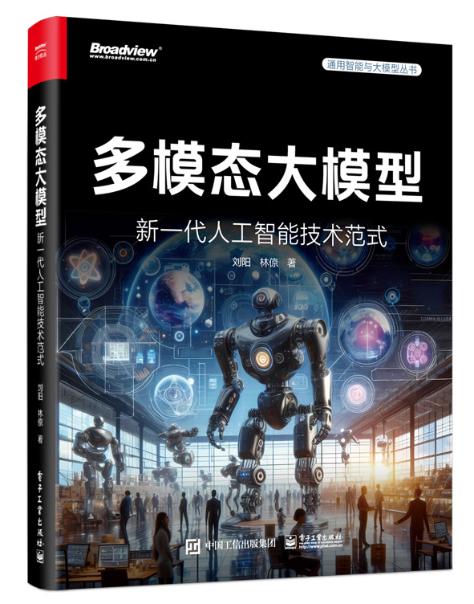

# 《多模态大模型：新一代人工智能技术范式》在线资源

  

## 本书介绍
本书以深入浅出的方式介绍多模态大模型的技术方法、开源平台和应用场景，并详细阐述因果推理、世界模型及多智能体与具身智能等前沿技术领域，有助于读者全面了解多模态大模型的特点及发展方向，对新一代人工智能技术范式和通用人工智能的发展起到重要推动作用。
全书共 5 章，第 1 章深入探讨最具代表性的大模型结构，第 2 章深度剖析多模态大模型的核心技术，第 3 章介绍多个具有代表性的多模态大模型，第 4 章深入分析视觉问答、 AIGC 和具身智能这 3 个典型应用，第 5 章探讨实现通用人工智能的可行思路。
本书不仅适合高校相关专业高年级本科生和研究生作为教材使用，更是各类 IT 从业者的必备参考之作。

## [目录电子版](https://github.com/HCPLab-SYSU/Book-of-MLM/blob/main/Catalogue.pdf)

## [参考文献电子版](https://github.com/HCPLab-SYSU/Book-of-MLM/blob/main/Reference.pdf)

### 更多电子资源敬请期待！

